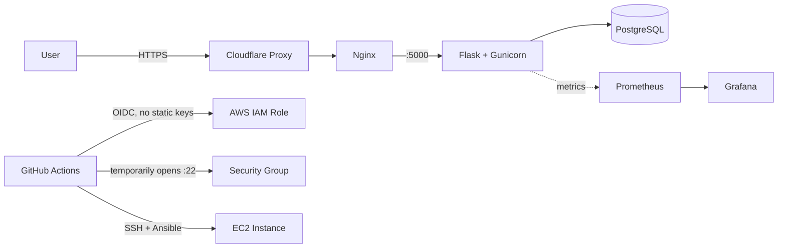

# DevOps Project 1 — Flask Todo App


## Overview
Pet-project Flask todo app used to practice a full DevOps pipeline end to end: infrastructure as code, configuration management, containerisation, CI/CD, and monitoring — deployed on a single AWS EC2 instance.

## Architecture



## Tech Stack
| Layer | Tools |
|---|---|
| App | Python / Flask / Gunicorn |
| Containers | Docker / Docker Compose |
| IaC | Terraform |
| Config management | Ansible |
| CI/CD | GitHub Actions (OIDC → AWS, no static keys) |
| Monitoring | Prometheus / Grafana |
| Reverse proxy / TLS | Nginx / Certbot (Let's Encrypt) |
| DNS / CDN | Cloudflare |
| Cloud | AWS EC2 |
| Orchestration (practice track) | Kubernetes / Helm / ArgoCD |

## Project Structure
```
├── app/            # Flask application
├── infra/
│   ├── terraform/  # EC2, Elastic IP, security group
│   └── ansible/    # common, docker, nginx, app, certbot roles
├── k8s/            # Helm chart + ArgoCD (parallel practice track)
└── monitoring/     # Prometheus config
```

## Infrastructure
- EC2 `t3.micro`, 20GB gp3 root volume (auto-expanded via `growpart`/`resize2fs` in the `common` role)
- Security group: SSH / Grafana / Prometheus restricted to the operator's current public IP (fetched live via Terraform's `data "http"`, never hardcoded); HTTP/HTTPS/app port open to everyone
- Domain `tiffeadev.uk` via Cloudflare (proxied — origin IP hidden)
- TLS via Let's Encrypt (`certbot --nginx`); nginx's config is a Jinja2 template that adapts depending on whether a certificate already exists, so redeploys don't wipe HTTPS

## CI/CD
On push to `main`:
1. **build** job — builds and pushes the Docker image to Docker Hub
2. **deploy** job — assumes an AWS IAM Role via GitHub's OIDC provider (no long-lived AWS keys stored anywhere), temporarily opens port 22 in the security group for the runner's own IP, runs the Ansible playbook over SSH, then closes the port again

## Local Development
```bash
git clone https://github.com/Tiffea/devops_project1
cd devops_project1
docker compose up --build
```

## Kubernetes (local, practice track)
```bash
minikube start
helm install devops-project1 ./k8s/helm/my-app
```
#for notes
