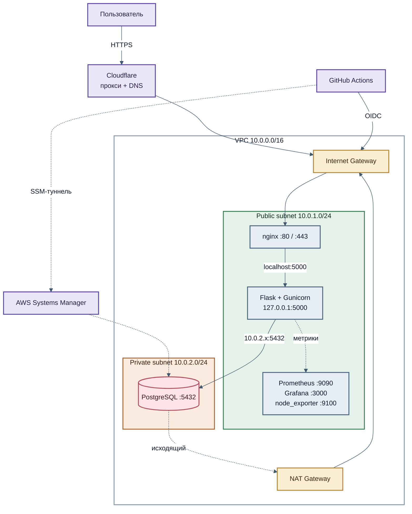
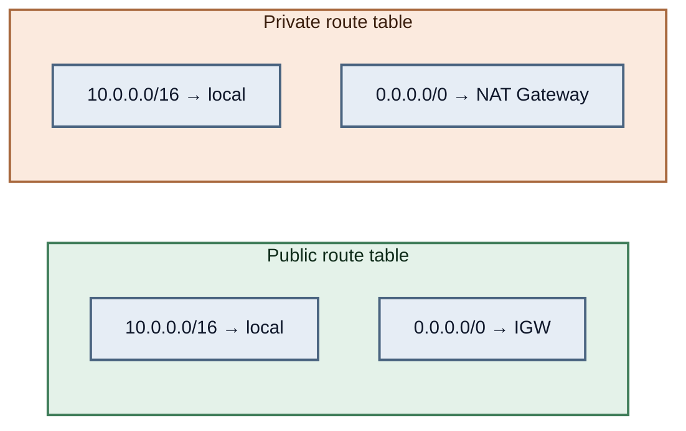
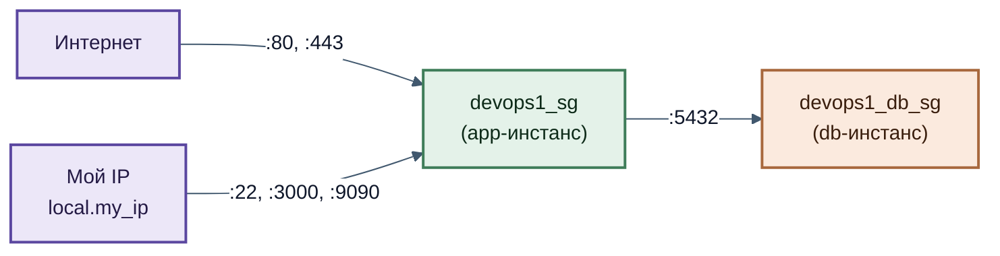
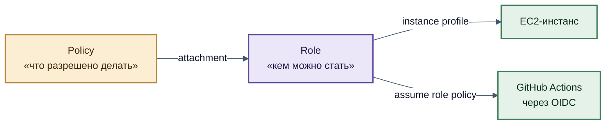
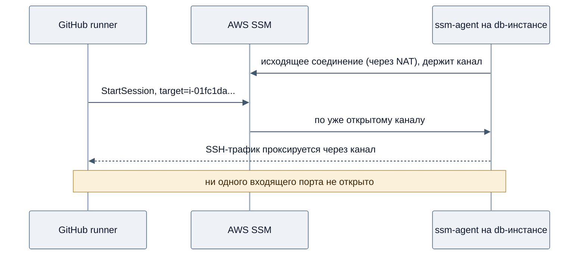
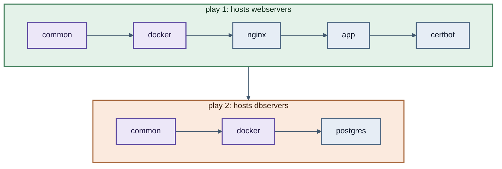
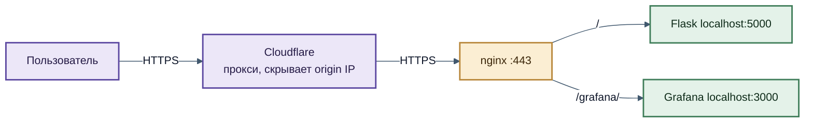

# DevOps Project 1 — карта проекта (личная версия)

> Это внутренний документ «для себя»: не витрина, а карта. Здесь записано **что где лежит**, **почему сделано именно так** и **где сейчас дыры**. Публичный README сделаем отдельно.
>
> Дата среза: **14 августа 2026**, ветка `main`.

---

## Оглавление

1. [Что это за проект в одном абзаце](#1-что-это-за-проект-в-одном-абзаце)
2. [Общая картина](#2-общая-картина)
3. [Слой 1: Сеть (VPC)](#3-слой-1-сеть-vpc)
4. [Слой 2: Compute — два инстанса](#4-слой-2-compute--два-инстанса)
5. [Слой 3: Данные — Postgres](#5-слой-3-данные--postgres)
6. [Слой 4: IAM — кто что имеет право делать](#6-слой-4-iam--кто-что-имеет-право-делать)
7. [Слой 5: SSM — доступ без бастиона](#7-слой-5-ssm--доступ-без-бастиона)
8. [Слой 6: Конфигурация — Ansible](#8-слой-6-конфигурация--ansible)
9. [Слой 7: Приложение и контейнеры](#9-слой-7-приложение-и-контейнеры)
10. [Слой 8: CI/CD](#10-слой-8-cicd)
11. [Слой 9: Сеть снаружи — nginx, TLS, Cloudflare](#11-слой-9-сеть-снаружи--nginx-tls-cloudflare)
12. [Слой 10: Наблюдаемость](#12-слой-10-наблюдаемость)
13. [Параллельный трек: Kubernetes](#13-параллельный-трек-kubernetes)
14. [Журнал ключевых решений](#14-журнал-ключевых-решений)
15. [Известные дыры и backlog](#15-известные-дыры-и-backlog)
16. [Шпаргалка: где что лежит](#16-шпаргалка-где-что-лежит)

---

## 1. Что это за проект в одном абзаце

Flask-приложение (todo-лист) на Postgres, развёрнутое в собственном AWS VPC на двух EC2-инстансах: приложение в публичной подсети, база — в приватной. Вся инфраструктура описана в Terraform, конфигурация серверов — в Ansible, деплой автоматизирован через GitHub Actions с доступом к AWS по OIDC (без статических ключей). Доступ к приватному инстансу БД — через AWS Systems Manager, без бастиона и без открытых портов.

Цель проекта — **не** работающий todo-лист. Цель — руками пройти весь путь DevOps-пайплайна и понять, почему каждый кусок устроен именно так.

---

## 2. Общая картина



Что важно прочитать на этой схеме:

- **Один вход снаружи** — только через Cloudflare → IGW → nginx. Всё остальное закрыто.
- **База не имеет входа снаружи вообще**, но имеет выход наружу через NAT (для apt-обновлений и SSM-агента).
- **GitHub Actions ходит двумя разными путями**: к app-серверу — по SSH через публичный IP (временно открыв порт 22), к db-серверу — через SSM-туннель, вообще без открытых портов.

---

## 3. Слой 1: Сеть (VPC)

**Файл:** `infra/terraform/networks.tf`

### Что есть

| Ресурс | Значение | Назначение |
|---|---|---|
| `aws_vpc.devops1_vpc` | `10.0.0.0/16` | Собственная сеть, не default VPC |
| `aws_subnet.devops1_public_subnet` | `10.0.1.0/24` | App-сервер |
| `aws_subnet.devops1_private_subnet` | `10.0.2.0/24` | DB-сервер |
| `aws_internet_gateway.devops1_gateway` | — | Двусторонний выход в интернет для public subnet |
| `aws_nat_gateway.devops1_nat_gateway` | сидит в public subnet | Односторонний (исходящий) выход для private subnet |
| `aws_eip.devops1_nat_eip` | — | NAT-шлюзу нужен статический публичный IP |
| 2 × route table + associations | — | Собственно то, что делает подсеть «публичной» или «приватной» |

### Ключевой концепт: что делает подсеть приватной

Это **не** флаг в настройках подсети. Подсеть становится публичной или приватной исключительно из-за того, куда её route table отправляет маршрут `0.0.0.0/0`:



- **IGW** пропускает трафик в обе стороны → инстанс с публичным IP доступен снаружи.
- **NAT Gateway** пропускает только исходящие соединения и ответы на них → инстанс может сам инициировать связь наружу, но снаружи его инициировать нельзя.

### Ключевой концепт: local route

Строка `10.0.0.0/16 → local` есть в **обеих** таблицах и создаётся AWS автоматически — её нельзя удалить. Именно поэтому app-инстанс из публичной подсети может обращаться к db-инстансу в приватной по приватному IP: маршрут внутри VPC существует всегда, независимо от того, публичная подсеть или приватная.

**Отсюда важный вывод:** «приватность» подсети не защищает инстансы друг от друга внутри VPC. Реальная граница доступа — security groups.

### Зачем базе NAT, если она ни для кого не сервер

Три причины, все — исходящие соединения, инициированные самим инстансом:

1. `apt update`/`apt upgrade` — обновления системы и Docker.
2. `docker pull postgres:16` — образ тянется из Docker Hub.
3. **SSM-агент** — он сам стучится наружу в AWS Systems Manager и держит соединение. Именно поэтому SSM не требует ни одного открытого входящего порта.

Стоит помнить: NAT Gateway — платный, и заметно (почасовая ставка + плата за трафик). Для пет-проекта это самая дорогая строка в счёте после инстансов. Альтернатива — VPC Endpoints для SSM, тогда NAT можно было бы убрать (но тогда сломались бы apt и docker pull).

### Security Groups

**Файл:** `infra/terraform/sec_groups.tf`



| SG | Ingress | Источник |
|---|---|---|
| `devops1_sg` | 80, 443 | `0.0.0.0/0` |
| | 22, 3000 (Grafana), 9090 (Prometheus) | `local.my_ip` — мой текущий IP |
| `devops1_db_sg` | 5432 | **другой security group**, не CIDR |

**Ключевой концепт: SG как источник.** В правиле для 5432 указан не диапазон адресов, а `security_groups = [aws_security_group.devops1_sg.id]`. Это значит «пускать любой инстанс, у которого прикреплён вот этот SG» — независимо от его IP. Если app-инстанс пересоздать и он получит другой IP, правило продолжит работать. Это удобнее и точнее, чем разрешать всю CIDR подсети (тогда любой новый инстанс в этой подсети автоматически получил бы доступ к базе).

**Ключевой концепт: `local.my_ip` не хардкодится.** В `main.tf`:

```hcl
data "http" "my_ip" {
  url = "https://checkip.amazonaws.com/"
}
locals {
  my_ip = "${chomp(data.http.my_ip.response_body)}/32"
}
```

Terraform при каждом `plan`/`apply` сам ходит и узнаёт мой текущий публичный IP. Побочный эффект: при смене IP (переезд, другой Wi-Fi) правило устаревает — нужно прогнать `apply` перед отладочной сессией. Это осознанный компромисс: лучше так, чем `0.0.0.0/0` на порт SSH.

---

## 4. Слой 2: Compute — два инстанса

**Файл:** `infra/terraform/main.tf`

| | app-сервер | db-сервер |
|---|---|---|
| Terraform-адрес | `aws_instance.devops_server` | `aws_instance.server_for_db` |
| Instance ID | `i-0f18485d4e36c1c20` | `i-01fc1da37e4c1bcb3` |
| Тип | `t3.small` | `t3.micro` |
| Диск | 20 GB gp3 | 8 GB gp3 |
| Подсеть | public | private |
| Публичный IP | Elastic IP `13.50.218.3` | нет |
| Приватный IP | — | `10.0.2.206` |
| Instance profile | нет | `DB_instance_profile` (для SSM) |
| Что крутится | nginx, Flask, Prometheus, Grafana, node_exporter | только Postgres |

### Почему app-серверу нужен Elastic IP, а db — нет

Elastic IP — это статический публичный адрес, который переживает stop/start инстанса. Он нужен, потому что на этот адрес указывает DNS-запись домена в Cloudflare: если бы IP менялся при каждом перезапуске, сайт бы отваливался.

У db-сервера публичного адреса нет вообще, а **приватный IP переживает stop/start** сам по себе (меняется только при terminate). Поэтому `db_private_ip = 10.0.2.206` можно держать константой в `site.yml`.

> ⚠️ Но это хрупко: если инстанс когда-нибудь пересоздать (`terraform destroy`/`apply`, а не stop/start), IP изменится, и это придётся править вручную в двух местах. Более правильно — прокидывать его через Terraform output → Ansible, но пока это захардкожено сознательно.

### Почему `t3.small` для приложения

Изначально был `t3.micro` (1 GB RAM) — не хватало памяти на одновременную сборку и работу Docker-стека. Помимо апгрейда до `t3.small` в роли `common` создаётся **swap-файл на 1 GB** — подстраховка от OOM-killer.

---

## 5. Слой 3: Данные — Postgres

### Как приложение находит базу

```mermaid
%%{init: {'theme':'base','themeVariables':{'background':'#ffffff','mainBkg':'#eef2f7','nodeBorder':'#4a6480','nodeTextColor':'#0f172a','primaryColor':'#eef2f7','primaryTextColor':'#0f172a','primaryBorderColor':'#4a6480','secondaryColor':'#eef2f7','secondaryTextColor':'#0f172a','secondaryBorderColor':'#4a6480','tertiaryColor':'#fbfcfd','tertiaryTextColor':'#0f172a','tertiaryBorderColor':'#9aa8b8','clusterBkg':'#fbfcfd','clusterBorder':'#9aa8b8','lineColor':'#41586e','textColor':'#0f172a','titleColor':'#0f172a','edgeLabelBackground':'#ffffff','labelBackgroundColor':'#ffffff','fontFamily':'ui-sans-serif, system-ui, sans-serif','fontSize':'15px'},'flowchart':{'nodeSpacing':50,'rankSpacing':65,'padding':14,'useMaxWidth':true}}}%%
flowchart LR
    A["site.yml<br/>db_private_ip: 10.0.2.206"] --> B["Ansible роль app<br/>создаёт .env"]
    B --> C[".env на сервере<br/>DB_HOST=10.0.2.206"]
    C --> D["docker-compose.prod.yml<br/>DATABASE_URL=...@$DB_HOST:5432/todos"]
    D --> E["контейнер app<br/>переменная окружения"]
    E --> F["app.py<br/>os.getenv('DATABASE_URL')"]

    classDef src fill:#ece7f8,stroke:#5b47a0,stroke-width:2px,color:#241a45
    classDef host fill:#fbeed3,stroke:#b8873a,stroke-width:2px,color:#3b2609
    classDef run fill:#e4f2e9,stroke:#3f7d59,stroke-width:2px,color:#0e2b19
    class A,B src
    class C,D host
    class E,F run
```



Цепочка из пяти звеньев — и на каждом стыке был баг за время проекта. Важные детали:

- `.env` создаётся Ansible'ом с правами `0600` и **не хранится в git** (в `.gitignore`).
- Пароли приходят из GitHub Secrets → в Ansible через `-e`, а не лежат в репозитории.
- Docker Compose подставляет `${DB_HOST}` и `${POSTGRES_PASSWORD}` из `.env` **в момент создания контейнера**. Изменить `.env` и не пересоздать контейнер = ничего не изменится. Это и был один из самых долгих багов.

### Почему база в отдельном контейнере на отдельном сервере

Изначально Postgres был сервисом в том же `docker-compose.prod.yml`, на той же машине. Проблемы такой схемы:

1. Приложение и база конкурируют за память и CPU одной машины.
2. Любая компрометация app-контейнера — это доступ к базе на localhost.
3. Нельзя перезапустить/пересобрать приложение, не рискуя данными.
4. Нет пути к горизонтальному масштабированию приложения.

После миграции база живёт на отдельном инстансе в приватной подсети, недоступном из интернета вообще.

### Тонкость: зачем `ports: "5432:5432"` в compose базы

**Файл:** `infra/ansible/roles/postgres/tasks/main.yml`

Когда Postgres был сервисом в одном compose-файле с приложением, публиковать порт наружу было не нужно — контейнеры общались по внутренней сети Docker Compose по имени сервиса (`db:5432`). После переезда на отдельный сервер приложение обращается **по сети, с другой машины** — значит контейнер обязан опубликовать порт на хост. Отсутствие этой строки стоило целого раунда отладки с «Connection refused».

Заметь асимметрию с app-контейнером: там `127.0.0.1:5000:5000` (только loopback), а здесь `5432:5432` (все интерфейсы) — потому что сюда действительно нужно ходить с другой машины. Защита при этом не ослаблена: `devops1_db_sg` пускает на 5432 только инстансы с SG приложения.

### Где физически лежат данные

Named volume `db_postgres_data` → на диске `/var/lib/docker/volumes/db_postgres_data/_data`. Named volume (в отличие от анонимного) переживает `docker compose down` и пересоздание контейнера.

---

## 6. Слой 4: IAM — кто что имеет право делать

**Файл:** `infra/terraform/policies.tf`

### Ключевой концепт: четыре разных сущности

Это место, где легче всего запутаться. Четыре вещи, которые часто путают:



| Сущность | Что это | Аналогия |
|---|---|---|
| **Policy** | JSON-документ: какие действия над какими ресурсами разрешены | Список полномочий |
| **Role** | Идентичность, которую можно «надеть» | Должность |
| **Role policy attachment** | Связь между ними | Приказ о назначении полномочий должности |
| **Instance profile** | Обёртка, без которой EC2 не может надеть роль | Пропуск на конкретное рабочее место |

Instance profile — чисто технический артефакт: EC2 умеет принимать роль **только** через него. В UI AWS этот шаг спрятан (консоль создаёт профиль автоматически), поэтому в Terraform он выглядит неожиданно.

### Ключевой концепт: два вида trust policy

`assume_role_policy` отвечает на вопрос **«кому позволено надеть эту роль»** — это отдельно от того, что роль умеет делать.

**Для EC2** (`Role-for-EC2`) — доверяем сервису AWS:
```json
{"Effect": "Allow", "Principal": {"Service": "ec2.amazonaws.com"}, "Action": "sts:AssumeRole"}
```

**Для GitHub Actions** (`github_worker`) — доверяем федеративному OIDC-провайдеру, с условием на конкретный репозиторий:
```json
{"Principal": {"Federated": "...oidc-provider/token.actions.githubusercontent.com"},
 "Action": "sts:AssumeRoleWithWebIdentity",
 "Condition": {"StringLike": {"...:sub": "repo:Tiffea/devops_project1:*"}}}
```

Именно это условие — то, что не даёт чужому репозиторию притвориться моим. Без него любой GitHub-воркфлоу в мире смог бы принять эту роль.

### Роли в проекте

| Роль | Кто принимает | Что может |
|---|---|---|
| `github_worker` | GitHub Actions (OIDC) | открывать/закрывать порт 22 в SG (`github-actions-sg-toggle-role`); открывать SSM-сессии (`SSMconnection_policy`) |
| `Role-for-EC2` | db-инстанс (через `DB_instance_profile`) | `AmazonSSMManagedInstanceCore` — быть управляемым через SSM |
| `Github-instance-controller` | GitHub Actions (OIDC) | start/stop/describe инстансов **⚠️ создана вручную, не в Terraform** |

### Ключевой концепт: почему нет статических AWS-ключей

Классический подход — сгенерировать Access Key и положить в GitHub Secrets. Проблема: ключ живёт вечно, пока его не отзовут вручную; если он утечёт (лог, скриншот, скомпрометированный форк) — это постоянный доступ.

OIDC работает иначе: GitHub при запуске воркфлоу выдаёт короткоживущий подписанный токен, AWS его проверяет, сверяет с условием на репозиторий и выдаёт временные креды на время job'а. Утечь нечему — секретов нет.

### Гоча: `${aws:userid}` в Terraform

В `SSMconnection_policy` есть строка:
```hcl
Resource = "arn:aws:ssm:*:*:session/$${aws:userid}-*"
```
Двойной `$$` — экранирование. `${...}` в HCL означает интерполяцию Terraform, но здесь нужно передать литеральную строку `${aws:userid}` в IAM (это IAM-переменная, подставляемая уже самим AWS). Без экранирования Terraform падает с «Extra characters after interpolation expression».

---

## 7. Слой 5: SSM — доступ без бастиона

### Проблема

К db-инстансу в приватной подсети нужен доступ: и руками (посмотреть, отладить), и автоматически (Ansible при деплое). Но у него нет публичного IP и нет входящих правил.

Три классических варианта:

| Вариант | Как работает | Минусы |
|---|---|---|
| Bastion host | Отдельный инстанс в public subnet, через него SSH дальше | Ещё одна машина, которую надо содержать, патчить и защищать; ещё один открытый порт 22 |
| VPN | Site-to-site или client VPN в VPC | Сложно настроить, дорого |
| **SSM Session Manager** ✅ | Агент на инстансе сам держит исходящее соединение с AWS | Требует настройки IAM и агента, зависимость от AWS |

Выбран третий — баланс безопасности и удобства.

### Как это работает



Ключевая идея: **соединение всегда инициирует агент изнутри**. Снаружи в инстанс никто не стучится — поэтому SG может вообще не иметь входящих правил, и это всё равно работает.

Что нужно, чтобы заработало (все три обязательны):
1. SSM-агент на инстансе (в Ubuntu AMI предустановлен).
2. У инстанса — роль с `AmazonSSMManagedInstanceCore` через instance profile.
3. У того, кто подключается — право `ssm:StartSession`.

### Как это подключено к Ansible

Ansible умеет ходить только по SSH. Трюк — заставить SSH ходить через SSM-туннель.

**Файл:** `.github/workflows/build.yml`, шаг «Configure SSH for SSM tunnel»:
```
Host i-* mi-*
    ProxyCommand sh -c "aws ssm start-session --target %h --document-name AWS-StartSSHSession --parameters portNumber=%p"
    StrictHostKeyChecking no
```

Паттерн `Host i-* mi-*` ловит имена, похожие на instance ID. Поэтому в `inventory.ini` у db-сервера в поле `ansible_host` стоит **не IP, а instance ID**:
```ini
[dbservers]
db-server ansible_host=i-01fc1da37e4c1bcb3 ansible_user=ubuntu ...
```

> 💡 **Почему через `~/.ssh/config`, а не через `ansible_ssh_common_args` в inventory.** Изначально ProxyCommand был прописан прямо в inventory — и там ломался на вложенных кавычках (три уровня: Ansible → sh → aws). Отладка через `ansible-playbook -vvv` показала, что до `aws` доходила команда вообще без аргументов. `~/.ssh/config` — один уровень кавычек, читается человеком, работает.

---

## 8. Слой 6: Конфигурация — Ansible

**Файлы:** `infra/ansible/`

### Структура

```
site.yml                    # два play: webservers и dbservers
inventory.ini               # два хоста: по IP и по instance ID
ansible.cfg                 # remote_user, ключ, host_key_checking=False
roles/
├── common/                 # apt, growpart, resize2fs, swap
├── docker/                 # установка Docker + compose plugin
├── nginx/                  # nginx + Jinja2-шаблон конфига
├── app/                    # git clone/pull, .env, docker compose up
├── certbot/                # Let's Encrypt
└── postgres/               # docker-compose-db.yml, .env, up
```

### Два play в одном playbook



Роли `common` и `docker` переиспользуются на обеих машинах — в этом и смысл ролей.

**Гоча, на которой я попался:** переменные объявлены **на уровне play**, а не глобально. `db_private_ip` нужен в play для *webservers* (его потребляет роль `app`, создавая `.env`), а не в play для dbservers — хотя интуитивно кажется наоборот.

### Ключевой концепт: идемпотентность

Плейбук должен быть безопасен для повторного запуска — прогнать его дважды должно дать тот же результат, что и один раз.

Примеры из проекта:
- `apt: state=present` — установит, если нет; ничего не сделает, если есть.
- `growpart` обёрнут в `changed_when`/`failed_when`, потому что при повторном запуске он возвращает `NOCHANGE` и ненулевой код — без обёртки плейбук падал бы каждый второй раз.
- `docker compose up -d` сравнивает желаемое состояние с фактическим и пересоздаёт только изменившиеся контейнеры.

### Большой баг: `when:` на задаче старта контейнеров

Было так:
```yaml
- name: Start containers on first deploy
  command: docker compose -f {{ compose_file }} up -d
  when: not project_exists.stat.exists      # ← только при первом деплое!
```

Логика была: при первом деплое поднимаем, дальше пусть handler перезапускает по `notify` от git-таски. Проблема в том, что **handler срабатывает только если git заметил изменения в файлах**. А новый образ на Docker Hub, изменившийся `.env` — git об этом не знает. Результат: `.env` на диске обновлён, а контейнер крутится со старыми переменными, запечёнными при создании.

Стало:
```yaml
- name: Start containers on deploy
  command: docker compose -f {{ compose_file }} up -d --remove-orphans
```

Без условия — команда идемпотентна, лишний запуск ничего не ломает. `--remove-orphans` добавлен после того, как удалённый из compose-файла сервис `db` продолжал висеть на app-сервере как «сирота».

**Мораль:** не изобретать собственную логику «изменилось / не изменилось» поверх инструмента, который и так это умеет.

### Ещё одна мина: git-таски без `version:`

```yaml
- name: Pull latest code if exists
  git:
    repo: "{{ repo_url }}"
    dest: "{{ project_dir }}"
    update: yes
    # version: не указан → всегда тянет ветку по умолчанию (main)
```

Из-за этого пуш в `stage` запускал CI, CI успешно отрабатывал — но на сервер приезжал код из `main`. Обходной путь сейчас: мержить `stage` → `main`. Правильный фикс (отложен): `version: "{{ git_branch }}"` + прокидывать `-e "git_branch=${{ github.ref_name }}"` из воркфлоу.

---

## 9. Слой 7: Приложение и контейнеры

### Три compose-файла и зачем каждый

| Файл | Где используется | Особенности |
|---|---|---|
| `docker-compose.yml` | локальная разработка на ноуте | `build: .` (сборка из исходников), **свой** сервис `db`, порт `5001:5000` |
| `docker-compose.prod.yml` | app-сервер | образ из Docker Hub, **без** сервиса `db`, `127.0.0.1:5000:5000` |
| `docker-compose-db.yml` | db-сервер (генерируется Ansible'ом) | только Postgres, `5432:5432` |

> ⚠️ Локальный файл **сознательно** не синхронизирован с прод-версией: ноутбук физически не может достучаться до приватной подсети VPC, поэтому локально нужна своя база. Один раз я его «починил», сделав как в проде, — и сломал локальную разработку.

### Прод-стек на app-сервере

- `app` — Flask + Gunicorn (4 воркера), слушает 5000, опубликован **только на loopback**
- `node_exporter` — метрики хоста
- `prometheus` — сбор метрик, порт 9090 (доступен только с моего IP)
- `grafana` — дашборды, 3000, проксируется nginx'ом на `/grafana/`

Named volumes: `prometheus_data`, `grafana_data`.

### Ключевой концепт: почему порт 5000 привязан к 127.0.0.1

Было `"5000:5000"` — то есть publish на **все** интерфейсы, включая публичный. Плюс правило в SG на 5000 с `0.0.0.0/0`. Итог: к приложению можно было прийти напрямую по `http://IP:5000`, минуя nginx — а значит минуя TLS, минуя Cloudflare, минуя всё, что можно повесить на реверс-прокси.

Разобранная механика: docker при publish создаёт правило DNAT в iptables на хосте. Если host IP не указан, правило создаётся для `0.0.0.0` (все интерфейсы). Указав `127.0.0.1:5000:5000`, правило создаётся только для loopback — nginx (процесс на том же хосте, ходит на `localhost:5000`) проходит, внешний трафик — нет.

Фикс в двух слоях:
1. `docker-compose.prod.yml` → `127.0.0.1:5000:5000`
2. `sec_groups.tf` → ingress-правило на 5000 удалено целиком

**Два независимых слоя** — это не дублирование. SG работает на границе VPC, docker-биндинг — на уровне хоста. Каждый защищает, даже если второй ошибочно откроют.

Для отладки в обход nginx теперь: зайти на хост (SSH/SSM) и `curl localhost:5000` оттуда.

---

## 10. Слой 8: CI/CD

### `build.yml` — сборка и деплой

Триггер: push в `main` или `stage`.

```mermaid
%%{init: {'theme':'base','themeVariables':{'background':'#ffffff','mainBkg':'#eef2f7','nodeBorder':'#4a6480','nodeTextColor':'#0f172a','primaryColor':'#eef2f7','primaryTextColor':'#0f172a','primaryBorderColor':'#4a6480','secondaryColor':'#eef2f7','secondaryTextColor':'#0f172a','secondaryBorderColor':'#4a6480','tertiaryColor':'#fbfcfd','tertiaryTextColor':'#0f172a','tertiaryBorderColor':'#9aa8b8','clusterBkg':'#fbfcfd','clusterBorder':'#9aa8b8','lineColor':'#41586e','textColor':'#0f172a','titleColor':'#0f172a','edgeLabelBackground':'#ffffff','labelBackgroundColor':'#ffffff','fontFamily':'ui-sans-serif, system-ui, sans-serif','fontSize':'15px'},'flowchart':{'nodeSpacing':50,'rankSpacing':65,'padding':14,'useMaxWidth':true}}}%%
flowchart TB
    subgraph build["job: build"]
        B1[checkout] --> B2[login Docker Hub] --> B3["build + push<br/>tiffea/devops-project1:latest"]
    end
    subgraph deploy["job: deploy (needs: build)"]
        D1[checkout] --> D2["assume role<br/>github_worker via OIDC"]
        D2 --> D3[узнать IP раннера]
        D3 --> D4["открыть :22 в SG<br/>только для этого IP"]
        D4 --> D5[install ansible + ssm plugin]
        D5 --> D6["~/.ssh/config<br/>ProxyCommand для i-*"]
        D6 --> D7[ansible-playbook site.yml]
        D7 --> D8["закрыть :22<br/>if: always()"]
    end
    build --> deploy

    classDef window fill:#fbeed3,stroke:#b8873a,stroke-width:2px,color:#3b2609
    classDef node fill:#e6edf5,stroke:#4a6480,stroke-width:2px,color:#0f172a
    class B1,B2,B3,D1,D2,D3,D5,D6,D7 node
    class D4,D8 window
    style build fill:#ece7f8,stroke:#5b47a0,stroke-width:2px,color:#241a45
    style deploy fill:#e4f2e9,stroke:#3f7d59,stroke-width:2px,color:#0e2b19
```



### Ключевой концепт: временное открытие порта 22

Порт SSH не открыт постоянно даже для моего IP — GitHub-раннер каждый раз получает случайный публичный IP, и заранее его не угадать. Поэтому воркфлоу:

1. Узнаёт свой IP (`curl checkip.amazonaws.com`)
2. Добавляет ingress-правило именно на `/32` этого IP
3. Деплоит
4. Удаляет правило — **с `if: always()`**, чтобы правило снялось даже если деплой упал

Роль `github_worker` при этом ограничена **только** двумя действиями (`AuthorizeSecurityGroupIngress`, `RevokeSecurityGroupIngress`) и **только** на конкретный SG (`Resource = aws_security_group.devops1_sg.arn`). Даже полная компрометация воркфлоу не даст ничего, кроме возможности дёргать одно правило.

> ⚠️ Слабое место паттерна: перед шагом закрытия делается повторный `configure-aws-credentials` — потому что временные креды могут протухнуть за время долгого деплоя. Если и это упадёт, правило останется висеть.

### `instance-control.yml` — кнопка вкл/выкл с телефона

Триггеры: `workflow_dispatch` (кнопка Run workflow в мобильном приложении GitHub) и `schedule` в 19:00 UTC (авто-выключение, чтобы не жечь деньги ночью).

Управляет **обоими** инстансами одним вызовом. Роль — `Github-instance-controller`, отдельная от `github_worker` (принцип наименьших привилегий: у роли деплоя нет права выключать машины, и наоборот).

**Гоча с JMESPath.** Было:
```
--query 'Reservations[0].Instances[0].State.Name'
```
Это жёстко берёт первую резервацию и первый инстанс в ней — при двух инстансах покажет статус только одного. Стало:
```
--query 'Reservations[].Instances[].[InstanceId,State.Name]'
```
Пустые `[]` «расплющивают» оба уровня вложенности, отдавая по строке на инстанс.

> ⚠️ **Незакрытый хвост:** в managed policy `StartStopInstance` в `Resource` прописан ARN инстанса `i-0faa32e5364fb0f38`, который не совпадает ни с одним из текущих. Похоже, что осталось от пересозданного инстанса. Пока не поправлено — start/stop может падать с `AccessDenied`.

---

## 11. Слой 9: Сеть снаружи — nginx, TLS, Cloudflare



### Ключевой концепт: шаблон nginx, зависящий от наличия сертификата

**Файл:** `infra/ansible/roles/nginx/templates/nginx.conf`

Конфиг — Jinja2-шаблон с ``. До получения сертификата генерируется HTTP-only конфиг; после — конфиг с редиректом 80→443 и TLS.

Зачем: без этого возникает курица-и-яйцо. Certbot в режиме `--nginx` требует работающий nginx, чтобы пройти HTTP-01 challenge. Но если конфиг сразу ссылается на несуществующие файлы сертификатов, nginx не стартует. Шаблон решает это, а заодно делает повторный деплой безопасным — HTTPS не сносится.

Grafana проксируется на подпуть `/grafana/`, поэтому в её окружении заданы `GF_SERVER_ROOT_URL` и `GF_SERVER_SERVE_FROM_SUB_PATH=true` — иначе она генерирует ссылки от корня и ломается за прокси.

---

## 12. Слой 10: Наблюдаемость

**Файл:** `monitoring/prometheus.yml`

```yaml
scrape_configs:
  - job_name: 'flask-app'
    static_configs:
      - targets: ['app:5000']
  - job_name: 'node-exporter'
    static_configs:
      - targets: ['node_exporter:9100']
```

Обе цели указаны по **именам сервисов Docker Compose** — работает, потому что Prometheus и цели живут в одной compose-сети на app-сервере.

Приложение отдаёт метрики через `prometheus_flask_exporter` (обёртка вокруг Flask, автоматически считает запросы, латентность, коды ответов) на `/metrics`.

### Что НЕ мониторится

| Дыра | Последствие |
|---|---|
| **db-сервер вообще не мониторится** | Кончится диск/память — узнаю только когда упадёт приложение |
| Нет Alertmanager | Метрики есть, но никто не разбудит — надо самому смотреть в Grafana |
| Нет метрик самого Postgres | Не видно connections, размер БД, медленные запросы |
| Нет логов (Loki/ELK) | Только `docker logs` руками |

Для db-сервера потребуется: node_exporter контейнером + ingress 9100 в `devops1_db_sg` от `devops1_sg` + новый target с приватным IP в `prometheus.yml`.

---

## 13. Параллельный трек: Kubernetes

**Файлы:** `k8s/`

Отдельная ветка обучения, не связанная с продом на EC2. Что есть:

- **Helm chart** (`k8s/helm/my-app/`): deployment, service (NodePort), `_helpers.tpl`, зависимость от Bitnami postgresql 18.6.2
- **values.yaml**: 3 реплики, resource limits, liveness/readiness probes, autoscaling (выключен), ingress (выключен)
- **values.prod.yaml**: 1 реплика, лимиты повыше
- **ArgoCD Application** (`k8s/argocd/app.yaml`): GitOps — следит за `k8s/helm/my-app` в репозитории, `automated` sync с `prune: true` и `selfHeal: true`

### Ключевой концепт: GitOps

ArgoCD переворачивает модель деплоя. Обычный CI/CD — **push**: пайплайн снаружи заходит в кластер и применяет изменения. GitOps — **pull**: агент внутри кластера сам следит за git-репозиторием и приводит кластер в соответствие. `selfHeal: true` означает, что ручное изменение в кластере будет автоматически откачено к тому, что записано в git.

> 🔴 **Дыра:** `password123` захардкожен в `values.yaml` и `values.prod.yaml`, и в открытом виде лежит в git. Для учебного minikube — терпимо, но это ровно та ошибка, за которую в реальном проекте бьют по рукам. Правильно: Kubernetes Secret, а лучше External Secrets Operator / Sealed Secrets.

---

## 14. Журнал ключевых решений

| Решение | Альтернативы | Почему так |
|---|---|---|
| Своя VPC вместо default | default VPC | Контроль над подсетями и маршрутизацией; default VPC весь публичный |
| БД на отдельном инстансе | контейнер рядом с приложением; RDS | Изоляция и практика; RDS слишком «magic», меньше учебной ценности |
| SSM Session Manager | bastion host; VPN | Нет лишней машины, нет открытых портов, IAM вместо ключей |
| OIDC вместо статических ключей | Access Key в secrets | Нечему утечь, токен живёт минуты |
| Временное открытие :22 в CI | постоянно открытый :22 | Окно доступа сужено до одного IP и минут деплоя |
| `127.0.0.1:5000:5000` + удаление SG-правила | оставить порт под `local.my_ip` | Не полагаться на IP-allowlist там, где сервис вообще не нужен снаружи |
| `local.my_ip` через `data "http"` | хардкод IP | Не коммитить свой адрес; ценой — `apply` перед сессией |
| SG как источник в правиле 5432 | CIDR подсети | Переживает смену IP; не открывает доступ всей подсети |
| Terraform import вместо пересоздания | destroy/apply | Ресурсы созданы вручную намеренно (учёба через UI), потом взяты под управление |
| Elastic IP только для app | EIP на обоих | Приватный IP и так стабилен при stop/start; EIP стоит денег |
| Один compose для локальной разработки, другой для прода | один общий | Локально нет доступа в приватную подсеть |

---

## 15. Известные дыры и backlog

### Критичное

| # | Проблема | Где |
|---|---|---|
| 1 | `password123` в открытом виде в git | `k8s/helm/my-app/values.yaml`, `values.prod.yaml` |
| 2 | ARN в `StartStopInstance` не совпадает с реальными инстансами | IAM (вне репозитория) |
| 3 | Terraform state локальный | `infra/terraform/terraform.tfstate` — потеря = потеря управления инфраструктурой |

### Важное

| # | Проблема | Заметка |
|---|---|---|
| 4 | В CI нет ни одного теста/линта перед деплоем | Сломанный код едет в прод |
| 5 | Нет сканирования безопасности | Ни образов (Trivy), ни IaC (Checkov), ни секретов (gitleaks) |
| 6 | db-сервер не мониторится | Нет node_exporter, нет target в Prometheus |
| 7 | Нет Alertmanager | Метрики без алертов = никто не узнает вовремя |
| 8 | git-таски без `version:` | Пуш в `stage` деплоит код из `main` |
| 9 | `db_private_ip` захардкожен | Сломается при пересоздании инстанса |
| 10 | `Github-instance-controller` не в Terraform | State drift, как было с VPC |

### Архитектурное (осознанно отложено)

- Нет ALB — одна машина, значит есть точка отказа и нет горизонтального масштабирования
- Нет мультиокружений (dev/stage/prod) с раздельными state
- Нет бэкапов Postgres — вообще никаких
- Нет DR-плана

### Мелочи

- Осиротевший анонимный Docker volume на db-сервере (от `postgres-test`)
- В `README.md` написано `t3.micro` для app-сервера, а фактически `t3.small`
- В `site.yml` в конце висит комментарий-заметка `#add q`

---

## 16. Шпаргалка: где что лежит

```
devops_project1/
├── app/
│   ├── app.py                      # Flask: 5 роутов, SQLAlchemy, prometheus exporter
│   ├── Dockerfile                  # python:3.11-slim, gunicorn 4 воркера
│   └── templates/index.html
├── docker-compose.yml              # ЛОКАЛЬНАЯ разработка (build: ., свой db)
├── docker-compose.prod.yml         # ПРОД app-сервер (образ из hub, без db)
├── infra/
│   ├── terraform/
│   │   ├── main.tf                 # провайдеры, data.http my_ip, 2 инстанса, EIP
│   │   ├── networks.tf             # VPC, 2 подсети, IGW, NAT, 2 route table
│   │   ├── sec_groups.tf           # devops1_sg, devops1_db_sg
│   │   └── policies.tf             # роли, политики, instance profile
│   └── ansible/
│       ├── site.yml                # 2 play, все переменные
│       ├── inventory.ini           # webservers (по IP), dbservers (по instance ID)
│       ├── ansible.cfg
│       └── roles/{common,docker,nginx,app,certbot,postgres}/
├── .github/workflows/
│   ├── build.yml                   # build → deploy
│   └── instance-control.yml        # start/stop/status обоих инстансов
├── monitoring/prometheus.yml       # 2 scrape target
├── k8s/                            # Helm + ArgoCD (учебный трек)
└── problems.md                     # личные заметки о проблемах
```

### Команды, которые чаще всего нужны

```bash
# подключиться к db-инстансу (приватная подсеть, только через SSM)
aws ssm start-session --target i-01fc1da37e4c1bcb3

# посмотреть, что реально запущено и на каких интерфейсах порты
docker ps

# переменные внутри работающего контейнера (не то же, что .env на диске!)
docker exec <container> env

# где физически лежат данные Postgres
docker volume inspect db_postgres_data

# проверить, слушает ли что-то порт (Connection refused = путь открыт, никто не слушает;
# timeout = блокирует SG/файрвол)
bash -c 'echo > /dev/tcp/10.0.2.206/5432' && echo OK

# посмотреть содержимое managed policy
aws iam list-attached-role-policies --role-name <role>
aws iam get-policy --policy-arn <arn>              # узнать DefaultVersionId
aws iam get-policy-version --policy-arn <arn> --version-id <v>

# Terraform: что реально в state
tofu state list
tofu state show aws_instance.server_for_db

# отладка Ansible-соединения
ansible-playbook ... -vvv
```

---

*Документ отражает состояние на 14.08.2026. При изменении инфраструктуры — обновлять вместе с кодом.*
